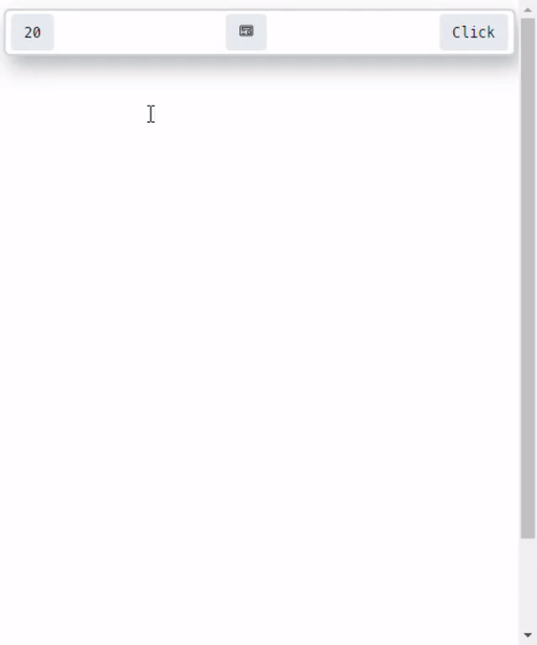

# Install
- See [Realse Page](https://github.com/anjiboss/quick-markdown-note/releases)

# Demo

# Configs
- Location: ~/.config/qmnote/config.toml
- Default Config Can Found in: [config.toml](./storage/config.toml)

# Features
- [x] fully supported markdown ( include code syntax highlight and table ).
- [x] configable Global Shortcut for reopen the app. (default is commandOrControl+Shift+O).
- [x] save template file 
  - configable ( `storage` )
  - default is $HOME/qmnote
  - file name is: __temp.md ( unchangable )
- [x] change edit/preview mode with ESC button.
- [x] change font size with:
  - + 1px: commandOrCtrl + [
  -  - 1px: commandOrCtrl + ] 
- [x] Lock the edit/preview mode with:
  - commandOrCtrl + L

# Check ideas for the project
[Idea](./.idea/roadmap.md)

# Stack
 - [Tauri](https://tauri.app/)
 - [React](https://reactjs.org/) with [Vite](https://vitejs.dev/)

# Workflow:
- [Save file](./.idea/saving-file.excalidraw)
